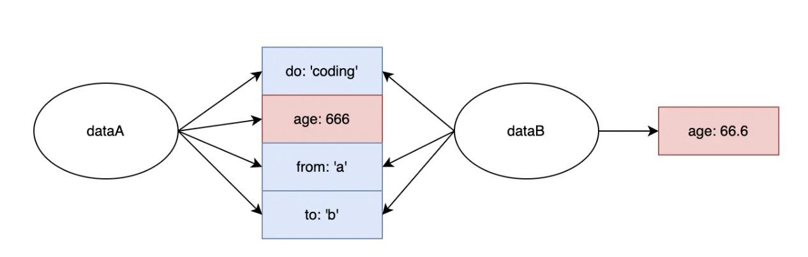
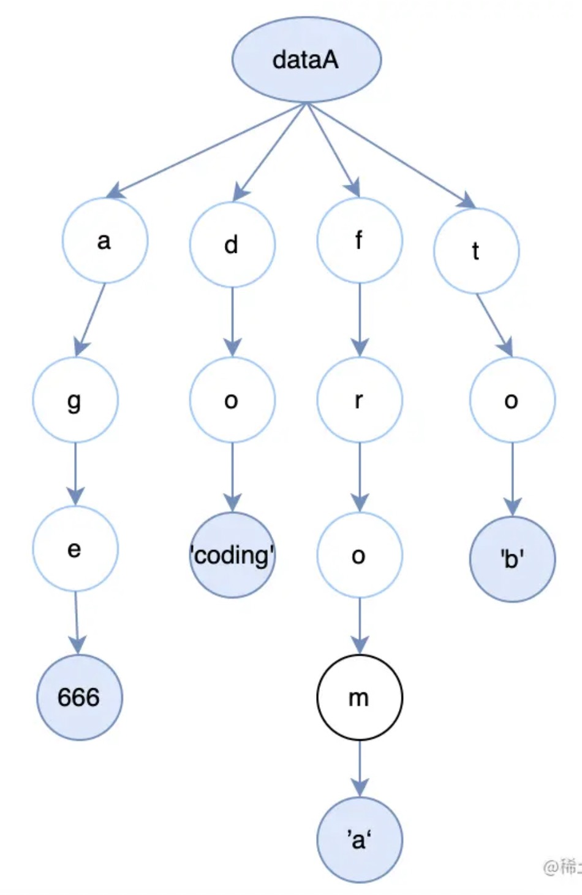
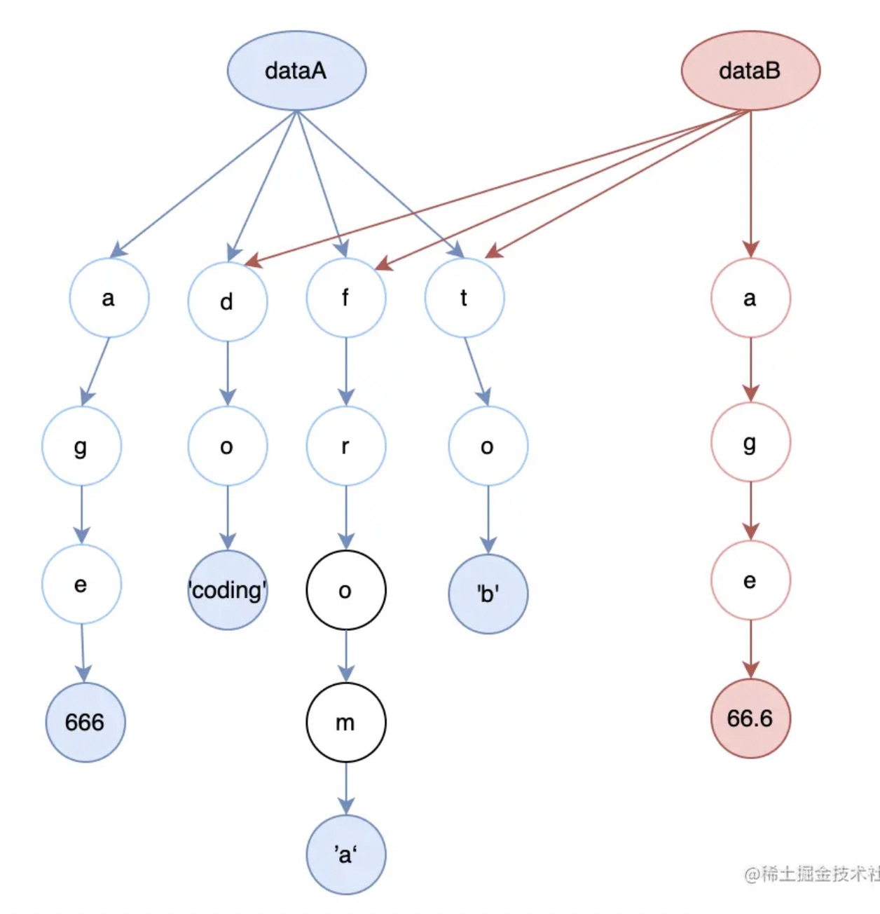

### 不可变数据的本质：函数纯度的“安全帽”

在我们编写函数的过程中，“可变数据”是最容易引发副作用的因素之一。强调“不可变数据”，实际上仍然是在强调函数的纯度—— “**坚持纯函数，避免副作用**”，这是函数式编程的实践宗旨。而"不可变数据"从实践的角度，对我们的编码行为作出了更加具体的约束，确保我们能够最大限度地输出纯净、安全的代码。

### JS 世界的"不可变数据"

### 值类型与引用类型

#### js 世界的数据类型

JS 中的数据类型，整体上来说只有两类：值类型（也称基本类型/原始值）和引用类型（也称复杂类型/引用值）。

- 值类型包括：String、Number、Boolean、null、undefined、Symbol、BigInt（大小固定、体积轻量、相对简单）
- 引用类型：Object（相对复杂、占用空间较大、且大小不定）

#### 不可变的值，可变的引用内容

保存值类型的变量是按值访问的， 保存引用类型的变量是按引用访问的。这两类数据之间最大的区别，在于变量保存了数据之后，我们还能对这个数据做什么。

- 值类型的赋值过程，本质上会创建一个新的值，然后这个变量会指向这个新的值，并不是修改数字本身。所以**这种自创建起就无法再被修改的数据，我们称其为“不可变数据”**。

```js
//我们修改 b 值的时候，其实是在修改数字 1、2 与“b 变量”之间的映射关系，而并不是在修改数字本身。

//把 a 赋值给 b，相当于在内存里开辟了一个新的坑位，然后将a值拷贝了一份、塞了进去。即a和b不会相互影响。
let a = 1;
let b = a;
// true
a === b;

b = 2;
// false
a === b;
```

- 引用类型的赋值过程，本质上是给同一块数据内容起一个新的名字。在引用指针不变的情况下，引用所指向的内容是可以发生改变的。**像这种创建后仍然可以被修改的数据，我们称其为“可变数据”。**

```js
//把 a 对象赋值给 b 时，JS 会直接把 a 指向实际数据的引用指针赋值给 b。即a 和 b 都会指向内存中的同一块数据
//b.name 被修改后，a、b 两个引用的指向没有发生任何变化——坑还是那个坑，但是坑里存的对象的内容却不一样了。

const a = {
  name: "xiuyan",
  age: 30,
};

const b = a;

// true
a === b;

b.name = "youhu";

// true
a === b;
```

### 为什么函数式编程不喜欢可变数据

#### 1. 可变数据会使数据的变化变得隐蔽，进而使函数的行为变得难以预测（即不确定性）

来看一个案例：两个小伙伴一起开发一个功能，需要根据对象信息的 level 等级是否大于 9，将招聘信息转给不同的招聘池。已知一条招聘信息 JOB_INFO_001，现在想要创建一条和它相同，但是 level 为 10 的 JOB_INFO_002，创建完后同时发布。

```js
//老王的模块
//修改招聘需求中的“Level（层级）”信息
function changeJobLevel(jobInfo, level) {
  //问题出来了！！！直接修改了入参 jobInfo 的内容，这导致 JOB_INFO_001 也发生了改变
  //jobInfo、newLevelJob、JOB_INFO_001 和 JOB_INFO_002 这四个“名字”指向的对象其实是同一个
  const newLevelJob = jobInfo;
  newLevelJob.level = level;
  return newLevelJob;
}

//你的模块
//检验招聘需求中的层级信息,来检验这是否是一则面向高管群体的招聘。
function isHighLevelJob(jobInfo) {
  return jobInfo.level >= 9;
}
//发布招聘,根据层级信息进入相应的招聘池
function releaseJobs(jobList) {
  jobList.forEach((job) => {
    if (isHighLevelJob(job)) {
      // 转发给猎头公司
    } else {
      // 转发到公司内部的池子里去
    }
  });
}
```

```js
//组装完成业务代码
import { changeJobLevel } from "老王的模块";
import { isHighLevelJob, releaseJobs } from "我自己的模块";

const JOB_INFO_001 = {
  level: 7,
  workTime: 2,
  type: "engineer",
  city: "New York",
};

// 基于 JOB_INFO_001，生成一个 level 为 10 的 JOB_INFO_002
const JOB_INFO_002 = changeJobLevel(JOB_INFO_001, 10);

// 组装两条数据为一个发布数组
const releaseList = [JOB_INFO_001, JOB_INFO_002];

// 发布两条数据
releaseJobs(releaseList, isHighLevelJob);
```

案例分析：在上面这个案例中， JOB_INFO_001 和 JOB_INFO_002 的 level 层级都变成了 10，进入了猎头公司，这就是一个典型的由可变数据所酿成的惨案（changeJobLevel() 函数直接修改了入参 jobInfo 的内容，这导致 JOB_INFO_001 也发生了改变）。

在函数式编程这种范式下，我们校验一个函数有效性的关键依据，永远是"**针对已知的输入，能否给出符合预期的输出**"，这样的校验非常清晰、且容易实现。
而可变数据的出现则将会使函数的作用边界变得模糊，进而导致使用者、甚至开发者自身都难以预测它的行为最终会指向什么样的结果。毫无疑问，这也会大大增加测试的难度。

#### 2. 可变数据使函数复用成本变高

可变数据的存在，要求我们不得不在调用一个函数之前，先去了解它的逻辑细节、定位它对外部数据的依赖情况和影响情况，由此来确保调用动作的安全性。

但很多情况下，当我们使用某一个函数的时候，我们会默认它是一个黑盒——我们关注的都是这个**函数的效用、输入与输出，而不会去关注它的实现细节**。因此，我们有必要确保，这个黑盒是可靠的、受控的。一个可靠、受控的黑盒，应该总是将变化控制在盒子的内部，而不去改变盒子外面的任何东西。

要想做到这一点，就必须把可变数据从我们的函数代码里铲除干净。

### 控制变化的几种姿势

程序失去变化，宛如人类失去灵魂。所以我们真正要做的，是控制变化，确保所有的变化都在可预期的范围内发生，从而防止我们的程序被变化“偷袭”。正如老话所说：不怕他来，就怕他乱来。

#### 1. JS 关键字 const

const 是单词"constant"(不变的)的缩写，限制开发者的 reassign（重新赋值）操作。但它只能够保证值类型数据的不变性，却不能够保证引用类型数据的不变性。

- 对于存储值类型数据的变量来说，const 确实能够确保其内容的不变性

```js
const price = 10;
price = 20;
//264:2 Uncaught TypeError: Assignment to constant variable.
```

- 对于引用类型来说，虽然重新赋值会报错，但不影响我们修改数据的内容(数据内容改变不需要 reassign，所以 const 察觉不到变化的发生)。

```js
//并没有将一个新的对象 reassign 给 me 变量，而是使用“.age”语法来访问并修改既有对象的其中一个属性。
const me = {
  name: "xiuyan",
  age: 30,
};

// 这一行不会报错
me.age = 35;
console.log(me);
```

事实上，由于值类型数据天然存在不可变性，当我们讨论“JS 数据不可变性”时，更多的其实就是在讨论如何保证【引用类型】数据的不可变性。

#### 2.拷贝，而不是修改（这里可以延伸到深拷贝、浅拷贝、lodash 的 deepClone 函数）

案例： 借助 dynamicCreateJob 函数完成：根据 已知 job1 工种生成 job2 工种，并且把 type 改为 teacher。<br>
案例分析：通过拷贝，我们顺利地将变化控制在了 dynamicCreateJob() 函数内部，避免了对全局其它逻辑模块的影响。baseJob 对于 dynamicCreateJob() 函数来说，成为了一个彻头彻尾的只读数据。

```js
const job1 = { type: "worker", sex: "boy", age: 30 };
function dynamicCreateJob(baseJob) {
  // 创建一个 baseJob 的副本
  let newJob = { ...baseJob };
  newJob.type = "teacher";
  return newJob;
}
const job2 = dynamicCreateJob(job1);
//{type: 'worker', sex: 'boy', age: 30}
console.log(job1);
//{type: 'teacher', sex: 'boy', age: 30}
console.log(job2);
```

对于函数式编程来说，**函数的外部数据是只读的，函数的内部数据则是可写的**。对于一个函数来说，”外部数据“可以包括全局变量、文件系统数据、数据库数据、网络层数据等。有且仅有这些外部数据，存在【只读】的必要。

> 注：由于纯函数只能通过参数获取数据，因此如果需要使用外部数据，就必须将其作为参数传递给函数。

缺点：对于状态简单、逻辑轻量的应用来说，拷贝确实不错。但当数据规模大、数据拷贝行为频繁时，拷贝将会给我们的应用性能带来巨大的挑战。拷贝出来的冗余数据将盘踞大量的内存，挤占其它任务的生存空间；此外，拷贝行为本身也是需要吃 CPU 的，持续而频繁的拷贝动作，无疑将拖慢应用程序的反应速度。

#### 3. 持久化数据结构，“安全帽”的进阶玩法

**回顾 Immutable.js**

Immutable 直译过来是“不可变的”，ImmutableJS 是对“不可变值”这一思想的贯彻实践。它在 2014 年被 Facebook 团队推出，Facebook 给它的定位是“实现持久化数据结构的库”。2016 年前后，我圈最流行的事情似乎就是为各种 React 应用引入 Immutable.js，因为 React 不喜欢可变数据，而 Immutable.js 恰好实现了不可变数据。

**代码 展示**

Immutable.js 提供了一系列的 Api，这些 Api 将帮助我们确保数据的不可变性。这里用 Immutable.js 写了一个 demo：

- 从代码上来看，它省掉了我们手动拷贝的麻烦。
- 从效率上来说，它在底层应用了持久化数据结构，解决了暴力拷贝带来的各种问题。

```js
// 引入 immutable 库里的 Map 对象，它用于创建对象
import { Map } from "immutable";

// 初始化一个对象 baseMap
const originData = Map({
  name: "xiuyan",
  hobby: "coding",
  age: 666,
});

// 使用 immutable 暴露的 Api 来修改 baseMap 的内容
const mutatedData = originData.set({
  age: 66.6,
});

// 我们会发现修改 baseMap 后将会返回一个新的对象，这个对象的引用和 baseMap 是不同的
console.log("originData === mutatedData", originData === mutatedData);
```

**那么持久化数据结构是怎么解决暴力拷贝带来的问题呢？**

持久化数据结构的精髓同样在于“数据共享”，意味着将“变与不变”分离，确保只有变化的部分被处理，而不变的部分则将继续留在原地、被新的数据结构所复用。举个例子：

```js
//假如我借助 Immutable.js 基于 A 对象创建出了 B 对象。

//A 对象有 4 个字段：
const dataA = Map({
  do: "coding",
  age: 666,
  from: "a",
  to: "b",
});

// 使用 immutable 暴露的 Api 来修改 baseMap 的内容
const dataB = dataA.set({
  age: 66.6,
});
```

Immutable.js 仅仅会创建变化的那部分(也就是创建一个新的 age 给 B)，其他复用 A 对象中不变的那 3 个字段。


其实，我们经常遇到和它很像的东西——git commit。在创建 commit 时，git 会对整个项目的所有文件做一个“快照”，快照的本质是对索引的记录（变化的文件将拥有新的存储空间+新的索引，不变的文件将永远呆在原地即是同一个索引），因此我们可以切换查看不同版本的文件。这是 git 应对变化的艺术，也是持久化数据结构的核心思想。(具体可以跳转到 git 篇)

**如何实现数据共享**

为了达到这种“数据共享”的效果，持久化数据结构在底层依赖了一种经典的基础数据结构，那就是 Trie(字典树）。在 Trie 的加持下，我们存储一个对象的姿势可以是这样的：



当我们创建对象 B 的时候，我们可以只针对发生变化的 age 字段创建一条新的数据，并将对象 B 剩余的指针指回 A 去，如下图：


在图示中，B 显然已经区别于 A，是一个新的对象、具备一个新的索引。B 通过和 A 共享不变的那部分数据，成功地提升了管理数据的效率。

#### Proxy 代理模式，如 lmmer.js
