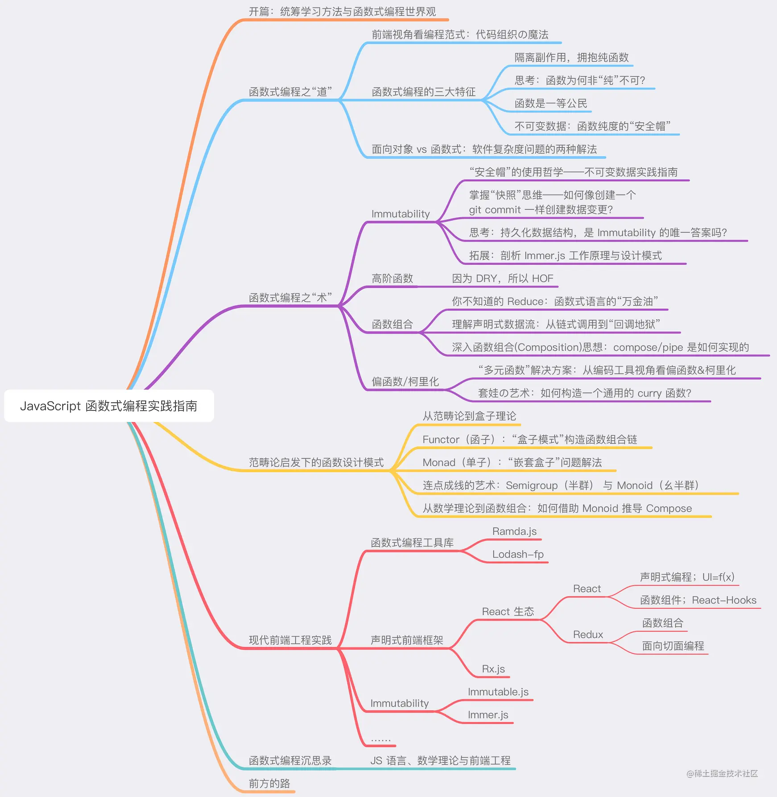

## 开篇导读

### 函数式编程是一种编程范式,更是“进阶套路”

编程范式可以理解为编程的风格/方式，它决定了我们将以一种什么样的方法和规范去组织自己的代码，是一门研究“如何写代码”的学问。 
对前端工程师来说，我们可能接触过的编程范式有以下几种（JS 是多范式的编程语言，它同时包罗了这 3 种编程范式）：

- 命令式编程（比如 C 语言、BASIC 语言）
  - 过程思维：你需要一步一步地告诉计算机应该“怎样做”。
- 面向对象编程（比如 Java、C++语言）
- 函数式编程（比如 Haskell、Clojure 语言）
  - 结果思维：不关心“怎样做”，只关心“输入与输出”。

函数式思想正在以越来越快的速度渗透前端生态，不管你有没有冲过函数式，轮子们已经先冲了，这些轮子包括但不限于：

- React
- Redux
- Ramda.js
- Lodash/fp
- Immutable.js
- Immer.js
- Rx.js（ReactiveX）
- Webpack

### 认识函数式编程

- 行业内较为主流的一种函数式编程定义
  > 函数式编程是一种强调以函数使用为主的软件开发风格。 ——[美]路易斯·阿泰西奥
- 以”全面、详尽“而著称的 Wikipedia 定义
  > 函数式编程（英语：functional programming）或称函数程序设计、泛函编程，是一种编程范式。
  > 它将电脑运算视为函数运算，并且避免使用程序状态以及易变对象。
  > 其中，λ 演算为该语言最重要的基础。而且，λ 演算的函数可以接受函数作为输入参数和输出返回值。 ——Wikipedia
- 从范式特征来理解，就 JS 函数式编程而言，以下三个特征可以说是没跑了：
  - 拥抱纯函数，隔离副作用
  - 函数是“一等公民”
  - 避免对状态的改变（不可变值）

### 知识体系思维导图

