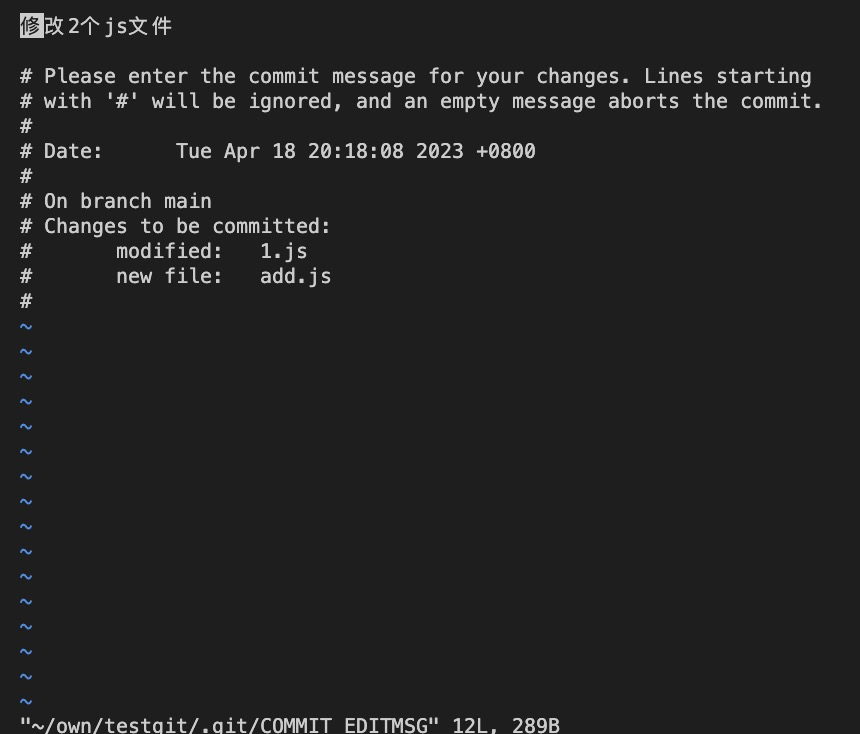

### 获取 Git 仓库

通常有两种获取 Git 项目仓库的方式：

#### 第一种：将尚未进行版本控制的本地目录转换为 Git 仓库:

1.初始化 Git，该命令将创建一个名为 .git 的子目录，且含有初始化的 Git 仓库中所有的必须文件。（项目里的文件还没被跟踪）

```bash
# 在进入该项目目录中后执行命令
$ git init
```

2.通过`git add` 命令指定哪些文件被追踪，然后执行`git commit`进初始提交。（对非空项目进行版本控制）

```bash
$ git add *.c
$ git add LICENSE
$ git commit -m 'initial project version'
```

#### 第二种：从其它服务器 克隆 一个已存在的 Git 仓库。

通过 `git clone <url>`命令克隆仓库：

- 比如，要克隆 Git 的链接库 libgit2，这会在当前目录下创建一个名为 “libgit2” 的目录，并在这个目录下初始化一个 .git 文件夹， 从远程仓库拉取下所有数据放入 .git 文件夹，然后从中读取最新版本的文件的拷贝。

```bash
$ git clone https://github.com/libgit2/libgit2

# 你也可以通过额外的参数指定新的目录名自定义本地仓库的名字
$ git clone https://github.com/libgit2/libgit2 mylibgit
```

补充：当你执行 git clone 命令的时候，默认配置下远程 Git 仓库中的每一个文件的每一个版本都将被拉取下来。 事实上，如果你的服务器的磁盘坏掉了，你通常可以使用任何一个克隆下来的用户端来重建服务器上的仓库 （虽然可能会丢失某些服务器端的钩子（hook）设置，但是所有版本的数据仍在，详见 [在服务器上搭建 Git](https://git-scm.com/book/zh/v2/%E6%9C%8D%E5%8A%A1%E5%99%A8%E4%B8%8A%E7%9A%84-Git-%E5%9C%A8%E6%9C%8D%E5%8A%A1%E5%99%A8%E4%B8%8A%E6%90%AD%E5%BB%BA-Git#_getting_git_on_a_server) ）。

### 记录每次更新到仓库

#### 检查文件状态

可以用 `git status` 命令查看哪些文件处于什么状态。

- 如果在克隆仓库后立即使用此命令，会看到类似这样的输出：

```bash
$ git status
# 当前在master分支
On branch master
# 当前分支同远程服务器上对应的分支没有偏离
Your branch is up-to-date with 'origin/master'.
# 现在的工作目录相当干净，所有已跟踪文件在上次提交后都未被更改过
nothing to commit, working directory clean
```

#### 忽略文件

一般我们总会有些文件无需纳入 Git 的管理，也不希望它们总出现在未跟踪文件列表。 我们可以在项目根目录创建一个名为 .gitignore 的文件，列出要忽略的文件的模式。

- 文件 .gitignore 的格式规范如下：

  - 所有空行或者以 # 开头的行都会被 Git 忽略。
  - 可以使用标准的 glob 模式匹配，它会递归地应用在整个工作区中。
  - 匹配模式可以以（/）开头防止递归。
  - 匹配模式可以以（/）结尾指定目录。
  - 要忽略指定模式以外的文件或目录，可以在模式前加上叹号（!）取反。

> 备注：
> glob 模式指 shell 所使用的简化了的正则表达式：<br>
> 星号（\*）匹配零个或多个任意字符；<br> > [abc] 匹配任何一个列在方括号中的字符 （这个例子要么匹配一个 a，要么匹配一个 b，要么匹配一个 c）；<br>
> 问号（?）只匹配一个任意字符；<br>
> 如果在方括号中使用短划线分隔两个字符， 表示所有在这两个字符范围内的都可以匹配（比如 [0-9] 表示匹配所有 0 到 9 的数字）。<br>
> 使用两个星号（\*\*）表示匹配任意中间目录，比如 a//z 可以匹配 a/z 、 a/b/z 或 a/b/c/z 等。<br>

- `.gitignore` 文件示例：

```bash
# 忽略所有以 .o 或 .a 结尾的文件（一般这类对象文件和存档文件都是编译过程中出现的。）
*.[oa]

# 忽略所有名字以波浪符~结尾的文件（许多文本编辑软件 比如 Emacs，都用这样的文件名保存副本）
*~

# 忽略所有 .c 文件
*.c

# 但跟踪所有的 lib.c，即便你在前面忽略了 .c 文件
!lib.a

# 只忽略当前目录下的 TODO 文件，而不忽略 subdir/TODO
/TODO

# 忽略任何目录下名为 build 的文件夹
build/

# 忽略 doc/notes.txt，但不忽略 doc/server/arch.txt
doc/*.txt

# 忽略 doc/ 目录及其所有子目录下的 .pdf 文件
doc/**/*.pdf
```

- 补充
  - 子目录下也可以有额外的 .gitignore 文件，其文件中的规则只作用于它所在的目录中。
  - GitHub 有一个十分详细的[针对数十种项目及语言的 .gitignore 文件列表](https://github.com/github/gitignore)

### 查看提交历史

你可以通过`git log`命令（也可传入参数，如`git log --pretty=format:"%h - %an, %ar : %s"`）查看提交历史。

- 因为 gitlab 上有可视化记录，基本需求满足，所以暂不做记录。可点击链接深入了解<https://git-scm.com/book/zh/v2/Git-%E5%9F%BA%E7%A1%80-%E6%9F%A5%E7%9C%8B%E6%8F%90%E4%BA%A4%E5%8E%86%E5%8F%B2>

```bash
# 按时间先后顺序列出所有的提交，最近的更新排在最上面
$ git log
commit ca82a6dff817ec66f44342007202690a93763949
Author: Scott Chacon <schacon@gee-mail.com>
Date:   Mon Mar 17 21:52:11 2008 -0700

    changed the version number

commit 085bb3bcb608e1e8451d4b2432f8ecbe6306e7e7
Author: Scott Chacon <schacon@gee-mail.com>
Date:   Sat Mar 15 16:40:33 2008 -0700

    removed unnecessary test

commit a11bef06a3f659402fe7563abf99ad00de2209e6
Author: Scott Chacon <schacon@gee-mail.com>
Date:   Sat Mar 15 10:31:28 2008 -0700

    first commit


# -p或--patch,它会显示每次提交所引入的差异(按补丁的格式输出)
# -2限制了显示数量(最近的2次提交)
$ git log -p -2
commit ca82a6dff817ec66f44342007202690a93763949
Author: Scott Chacon <schacon@gee-mail.com>
Date:   Mon Mar 17 21:52:11 2008 -0700

    changed the version number

diff --git a/Rakefile b/Rakefile
index a874b73..8f94139 100644
--- a/Rakefile
+++ b/Rakefile
@@ -5,7 +5,7 @@ require 'rake/gempackagetask'
 spec = Gem::Specification.new do |s|
     s.platform  =   Gem::Platform::RUBY
     s.name      =   "simplegit"
-    s.version   =   "0.1.0"
+    s.version   =   "0.1.1"
     s.author    =   "Scott Chacon"
     s.email     =   "schacon@gee-mail.com"
     s.summary   =   "A simple gem for using Git in Ruby code."

commit 085bb3bcb608e1e8451d4b2432f8ecbe6306e7e7
Author: Scott Chacon <schacon@gee-mail.com>
Date:   Sat Mar 15 16:40:33 2008 -0700

    removed unnecessary test

diff --git a/lib/simplegit.rb b/lib/simplegit.rb
index a0a60ae..47c6340 100644
--- a/lib/simplegit.rb
+++ b/lib/simplegit.rb
@@ -18,8 +18,3 @@ class SimpleGit
     end

 end
-
-if $0 == __FILE__
-  git = SimpleGit.new
-  puts git.show
-end
```

### 撤销操作

需求一：重新提交。

```bash
git commit --amend
```

- 例如：提交完了(git commit)才发现漏掉了几个文件没有添加，或者提交信息(commit msg)写错了。

```bash
# 最终你只会有一个提交——第二次提交将代替第一次提交的结果。
$ git commit -m '修改2个js文件'
$ git add add.js
$ git commit --amend
```

- 文本编辑器启动后，可以看到之前的提交信息（如图）。 编辑后保存会覆盖原来的提交信息(按 `i` 进入 Insert 编辑模式，修改完之后按`esc`,然后输入 `:wq` 回车保存退出)。
  
- 输入`git log -2`查看最近的 2 次提交历史（上面的操作把提交信息修改成了"修改 2 个 js 文件(1.js 和 add.js)"），可以发现新的提交替换了旧的提交，好像旧的提交从未存在过一样。

```bash
$ git log -2
commit 15b200e7a542721632081aeaf0313a1d2060bf6f (HEAD -> main)
Author: --global <1148127906@qq.com>
Date:   Tue Apr 18 20:18:08 2023 +0800

    修改2个js文件(1.js和add.js)

commit 96f81df8e4f19d3d602a090234766e000cd494e5
Author: --global <1148127906@qq.com>
Date:   Tue Apr 18 17:44:14 2023 +0800

    init
```

需求二：取消暂存的文件（可以通过 git status 获得提示）。

```bash
# 官方文档
$ git reset HEAD <file>

# 当前git版本(git version 2.37.0 (Apple Git-136))，git status获得的提示
$ git restore --staged <file>
```

- 例如，你已经修改了两个文件(1.js 和 add.js)并且想要将它们作为两次独立的修改提交， 但是却意外地输入 git add \* 暂存了它们两个。通过命令取消暂存两个中的一个。

```bash
# 提交到暂存后通过git status获得提示
$ git add *
$ git status
On branch main
Changes to be committed:
  (use "git restore --staged <file>..." to unstage)
        modified:   1.js
        modified:   add.js
```

```bash
# 可通过这个命令或提示中的命令取消暂存的文件
$ git reset HEAD 1.js
Unstaged changes after reset:
M       1.js
```

```bash
# 当工作目录(未暂存区)和暂存区都有修改的文件时，git status有针对暂存区、未暂存区的提示
$ git status
On branch main
Changes to be committed:
  (use "git restore --staged <file>..." to unstage)
        modified:   add.js

Changes not staged for commit:
  (use "git add <file>..." to update what will be committed)
  (use "git restore <file>..." to discard changes in working directory)
        modified:   1.js
```

需求三：撤销对未暂存文件的修改（可以通过 git status 获得提示）

```bash
# 官方文档
$ git checkout -- <file>
# 当前git版本(git version 2.37.0 (Apple Git-136))，git status获得的提示
$ git restore <file>
```

- 例如只修改了 1.js 并且在未暂存区，将它还原成上次提交时的样子（或者刚克隆完的样子，或者刚把它放入工作目录时的样子）

```bash
$ git checkout -- 1.js
$ git status
On branch main
nothing to commit, working tree clean
```

### 命令总结

```bash
# 初始化git
$ git init

# 指定哪些文件被追踪，进入暂存区
$ git add <file>

# 提交
$ git commit

# 克隆远程仓库
$ git clone <url>

# 查看哪些文件处于什么状态
$ git status

# 查看提交历史
$ git log
commit ca82a6dff817ec66f44342007202690a93763949
Author: Scott Chacon <schacon@gee-mail.com>
Date:   Mon Mar 17 21:52:11 2008 -0700

    changed the version number

commit a11bef06a3f659402fe7563abf99ad00de2209e6
Author: Scott Chacon <schacon@gee-mail.com>
Date:   Sat Mar 15 10:31:28 2008 -0700

    first commit

# 取消某文件的暂存（2选1）
$ git reset HEAD <file>
$ git restore --staged <file>

# 撤销对文件的修改，将它还原成上次提交时的样子（2选1）
$ git checkout — <file>
$ git restore <file>
```
