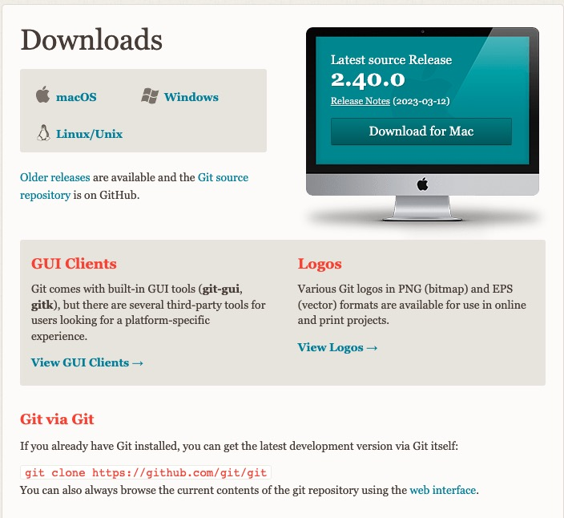

## git 基本使用

### Git 安装

在 Git 官网下载、安装即可：https://git-scm.com/download。

安装完成之后，可以使用以下命令来查看 Git 是否安装成功：

```bash
git --version
```

如果安装成功，终端会打印安装的 Git 的版本：

```bash
git version 2.37.0 (Apple Git-136)
```

### 初次运行 Git 前的配置

### 用户信息

安装完 Git 之后，要做的第一件事就是设置你的用户名和邮件地址。 这一点很重要，因为每一个 Git 提交都会使用这些信息，它们会写入到你的每一次提交中，不可更改：

```bash
$ git config --global user.name "John Doe"
$ git config --global user.email johndoe@example.com
```

查看设置的用户名/设置的 email：

```bash
git config user.name
git config user.email
```

再次强调，如果使用了 --global 选项，那么该命令只需要运行一次，因为之后无论你在该系统上做任何事情， Git 都会使用那些信息。 当你想针对特定项目使用不同的用户名称与邮件地址时，可以在那个项目目录下运行没有 --global 选项的命令来配置。

### 设置命令颜色

除了上述两个基本的设置之外，还可以设置命令的颜色，以使输出具有更高的可读性：

```bash
 #打开颜色显示
 git config --global color.ui true
 #关闭颜色显示，即默认黑白
 git config --global color.ui false
```

### 设置别名

git config 命令为我们提供了一种创建别名的方法，这种别名通常用于缩短现有的命令或者创建自定义命令。

```bash
# 这里为commit -m创建一个别名 cm
git config --global alias.cm "commit -m"

# 这样在提交暂存区文件时，只需要输入以下命令即可：
git cm <message>
```

### 检查配置信息

如果想要检查你的配置，可以使用 `git config --list` 命令来列出所有 Git 当时能找到的配置。

```bash
$ git config --list
credential.helper=osxkeychain
init.defaultbranch=main
user.name=suanmei
user.email=suanmei@yscredit.com
user.password=lymnofirst1
color.ui=true
core.repositoryformatversion=0
core.filemode=true
core.bare=false
core.logallrefupdates=true
core.ignorecase=true
core.precomposeunicode=true
core.hookspath=.husky
remote.origin.url=git@github.com:AliceLi11/vuepress-starter.git
remote.origin.fetch=+refs/heads/*:refs/remotes/origin/*
branch.main.remote=origin
branch.main.merge=refs/heads/main
```

你也可以通过输入 `git config <key>`： 来检查 Git 的某一项配置

```bash
$ git config user.name
John Doe
```

请记住，你工作目录下的每一个文件都不外乎这两种状态：已跟踪 或 未跟踪。 已跟踪的文件是指那些被纳入了版本控制的文件，在上一次快照中有它们的记录，在工作一段时间后， 它们的状态可能是未修改，已修改或已放入暂存区。简而言之，已跟踪的文件就是 Git 已经知道的文件。
未修改、已修改、暂存区
已跟踪、未跟踪
