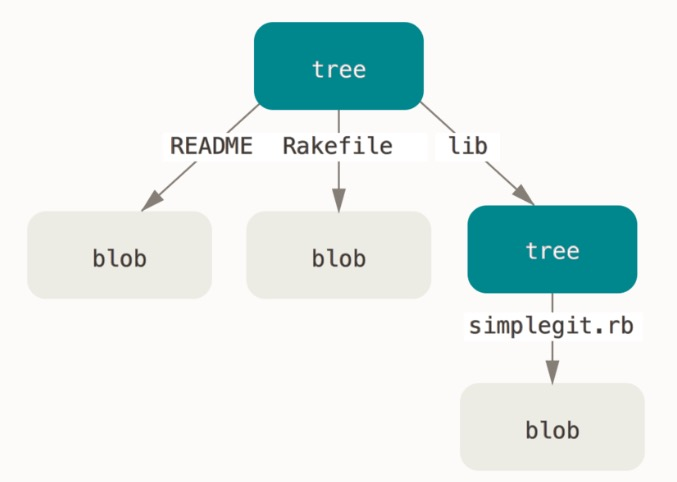
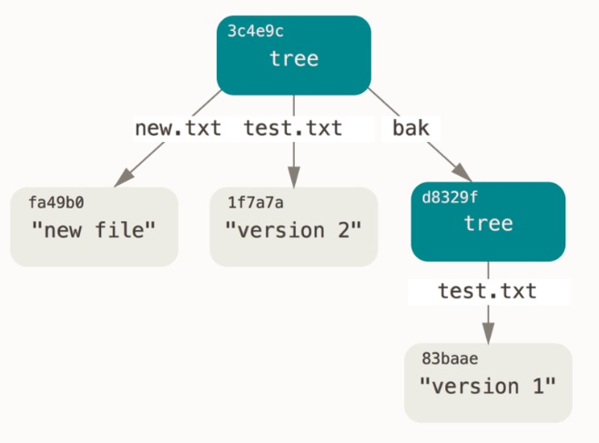

TODO1:.git 几个文件的几个功能熟知
TODO2:我们来认识一下上面的命令输出的长度为 40 个字符的键：这是一个 SHA-1 哈希值——一个将待存储的数据外加一个头部信息（header）一起做 SHA-1 校验运算而得的校验和。(放在其他篇幅讨论计算)
TODO3:[inodes]写个大概意思，然后借鉴链接(https://www.cnblogs.com/wanng/p/linux-inodes.html)

## .git 目录下的默认文件

当在一个新目录或已有目录执行 git init 时，Git 会创建一个 .git 目录。 这个目录包含了几乎所有 Git 存储和操作的东西。 如若想备份或复制一个版本库，只需把这个目录拷贝至另一处即可。

对于一个全新的 git init 版本库，这将是你看到的默认结构（随着 Git 版本的不同，该目录下可能还会包含其他内容）。

其中这四个条目很重要：HEAD 文件、（尚待创建的）index 文件，和 objects 目录、refs 目录，它们都是 Git 的核心组成部分。

```bash
# 此命令查找当前目录下的文件或文件夹，并且一行展示一个（-F -1）,更多信息可看bottomCommand.md
$ ls -F1


# 指向目前被检出的分支
HEAD
# 包含项目特有的配置选项
config
# 仅供 GitWeb 程序使用，无需关心
description
# 包含客户端或服务端的钩子脚本(hooks scripts)
hooks/
# 包含一个全局性排除（global exclude）文件，用以放置那些不希望被记录在 .gitignore文件中的忽略模式（ignored patterns）
info/
# 该目录存储所有数据内容
objects/
# 该目录存储指向数据（分支、远程仓库和标签等）的提交对象的指针
refs/

# (尚待创建的) 保存暂存区信息
# index
```

### Git 对象(objects 目录)

Git 是一个内容寻址文件系统，这意味着，Git 的核心部分是一个简单的键值对数据库（key-value data store）。你可以向 Git 仓库中插入任意类型的内容，它会返回一个唯一的键，通过该键可以在任意时刻再次取回该内容。

**Git 对象类型**

数据对象（blob object）

树对象（tree object）

提交对象（commit object）

标签对象（tag object）

#### 通过底层命令演示上面的功能

首先，我们需要初始化一个新的 Git 版本库，并确认 objects 目录为空：

```shell
# 在当前目录下新建test空文件夹，并且初始化git，将尚未进行版本控制的test目录转换为 Git 仓库（生成.git目录）
delGit % git init test
Initialized empty Git repository in /Users/dameizi/own/delGit/test/.git/
delGit % cd test
# 可以看到 Git 对 objects 目录进行了初始化，并创建了 pack 和 info 子目录，但均为空。
dameizi@dameizideMacBook-Pro test % find .git/objects
.git/objects
.git/objects/pack
.git/objects/info
```

##### 存储数据对象（blob object），即文件的内容

接着，我们用 `git hash-object` 创建一个新的数据对象并将它手动存入你的新 Git 数据库中：

```shell
# 在下面这种最简单的形式中，git hash-object 会接受你传给它的东西，而它只会返回可以存储在 Git 仓库中的唯一键。
# | 管道符将上一条命令的输出，作为下一条命令参数
# -w 会指示该命令不要只返回键，还要将该对象写入数据库中（即不写-w，则只会计算出它的键并返回出来，但是并不会写入数据库）
# 最后，--stdin 选项则指示该命令从标准输入读取内容（即管道符前面的输出作为它的输入）；若不指定此选项，则须在命令尾部给出待存储文件的路径
test % echo 'test content' | git hash-object -w --stdin
d670460b4b4aece5915caf5c68d12f560a9fe3e4
```

通过`find .git/objects -type f`（在.git/objects 目录下查找 type 为普通类型的文档）查看 Git 是如何存储数据的：

- 以计算出的 SHA-1 校验和为文件命名，其中前 2 个字符用于命名子目录，余下的 38 个字符则用作子文件名(位于子目录下)。

如果你再次查看 objects 目录，可以在其中找到一个与新内容对应的文件

```shell
# -type:查找某一类型文档 f:普通文档
test % find .git/objects -type f
.git/objects/d6/70460b4b4aece5915caf5c68d12f560a9fe3e4
```

一旦你将内容存储在了对象数据库中，那么可以通过 `git cat-file` 命令从 Git 那里取回数据。

```shell
# git cat-file 提供资源库对象的内容或类型和大小信息
# -s显示对象大小
# -t显示对象类型(blob(数据对象)/tree(树对象))
# -p自动判断内容的类型, Pretty-print（漂亮地打印）内容。
test % git cat-file -p d670460b4b4aece5915caf5c68d12f560a9fe3e4
test content
```

至此，你已经掌握了如何向 Git 中存入内容，以及如何将它们取出。 我们同样可以将这些操作应用于文件中的内容。 例如，可以对一个文件进行简单的版本控制。

```shell
# 为test.txt文件替换内容为version 1,如果文件不存在，则会创建
dameizi@dameizideMacBook-Pro test % echo 'version 1' > test.txt
# 将当前路径下的test.txt中的内容存入数据库，并返回存储在 Git 仓库中的唯一键
dameizi@dameizideMacBook-Pro test % git hash-object -w test.txt
83baae61804e65cc73a7201a7252750c76066a30
```

接着，向文件里写入新内容，并再次将其存入数据库：

```shell
dameizi@dameizideMacBook-Pro test % echo 'version 2' > test.txt
dameizi@dameizideMacBook-Pro test % git hash-object -w test.txt
1f7a7a472abf3dd9643fd615f6da379c4acb3e3a
```

对象数据库记录下了该文件的两个不同版本，当然之前我们存入的第一条内容也还在：

```shell
dameizi@dameizideMacBook-Pro test % find .git/objects -type f
.git/objects/d6/70460b4b4aece5915caf5c68d12f560a9fe3e4 #test content
.git/objects/1f/7a7a472abf3dd9643fd615f6da379c4acb3e3a #version 1
.git/objects/83/baae61804e65cc73a7201a7252750c76066a30 #version 1
```

现在可以在删掉 test.txt 的本地副本，然后用 Git 从对象数据库中取回它的第一个版本：

```shell
# 删掉了目录下的test.txt文件，从Git对象数据库中取出之前存入的第一个版本的内容，为新建的test.txt赋值
dameizi@dameizideMacBook-Pro test %  git cat-file -p 83baae61804e65cc73a7201a7252750c76066a30 > test.txt
# 查看test.txt文件内容
dameizi@dameizideMacBook-Pro test % cat test.txt
version 1

# 或取回它的第二个版本
dameizi@dameizideMacBook-Pro test % git cat-file -p 1f7a7a472abf3dd9643fd615f6da379c4acb3e3a > test.txt
dameizi@dameizideMacBook-Pro test % cat test.txt
version 2
```

然而，记住文件的每一个版本所对应的 SHA-1 值并不现实；另一个问题是，在这个（简单的版本控制）系统中，文件名并没有被保存——我们仅保存了文件的内容。 上述类型的对象我们称之为 数据对象（blob object）。 利用 git cat-file -t 命令，可以让 Git 告诉我们其内部存储的任何对象类型，只要给定该对象的 SHA-1 值：

```shell
# 查看内部存储的对象类型
dameizi@dameizideMacBook-Pro test % git cat-file -t 1f7a7a472abf3dd9643fd615f6da379c4acb3e3a
# 数据对象（blob object）
blob
```

##### 树对象（tree object）

它能解决文件名保存的问题，也允许我们将多个文件组织到一起。

Git 以一种类似于 UNIX 文件系统的方式存储内容，但作了些许简化。 所有内容均以树对象和数据对象的形式存储，其中树对象对应了 UNIX 中的目录项，数据对象则大致上对应了 [inodes](https://www.linuxidc.com/Linux/2009-05/20068.htm) 或文件内容。 一个树对象包含了一条或多条树对象记录（tree entry），每条记录含有一个指向数据对象或者子树对象的 SHA-1 指针，以及相应的模式、类型、文件名信息。

Inode 块中保存了一个文件系统中的全部 Inode 节点。也就是说，当系统创建了一个文件(或者添加了一个新设备)时，系统就会从这个块中给这个文件分配一个 Inode 结点。在这个结点中存储了这个文件的大部分属性，如创建、修改时间等等。但是需要注意的是，有两个属性不包含在这个 inode 结点中，分别为文件名与结点号。
另外需要注意的是，在 inode 结点中还存储着一个重要的信息，就是保存了一个包含 13-15 位指针元素的数组，这些指针是磁盘块区的地址。这些指针非常的重要。操作系统就是依靠这些指针在硬盘上定位相关的文件，并读取它。
由于一些文件的属性(如建立修改时间等等)都保存在 Inode 结点中，为此一些命令在获取这些属性的时候，是不需要打开文件的。

例如，某项目当前对应的最新树对象可能是这样的：

```bash
# master^{tree} 语法表示 master 分支上最新的提交所指向的树对象。
# 一个树对象包含了一条或多条树对象记录（tree entry），每条记录含有一个指向数据对象或者子树对象的 SHA-1 指针，以及相应的模式、类型、文件名信息。

# 三种模式即是 Git 文件（即数据对象）的所有合法模式（当然，还有其他一些模式，但用于目录项和子模块）
# 100644，表明这是一个普通文件
# 100755，表示一个可执行文件；
# 120000，表示一个符号链接。
$ git cat-file -p master^{tree}
100644 blob a906cb2a4a904a152e80877d4088654daad0c859      README
100644 blob 8f94139338f9404f26296befa88755fc2598c289      Rakefile
# lib 子目录指向的是另一个树对象
040000 tree 99f1a6d12cb4b6f19c8655fca46c3ecf317074e0      lib

$ git cat-file -p 99f1a6d12cb4b6f19c8655fca46c3ecf317074e0
100644 blob 47c6340d6459e05787f644c2447d2595f5d3a54b      simplegit.rb
```

补充

> 你可能会在某些 shell 中使用 master^{tree} 语法时遇到错误。
> 在 Windows 的 CMD 中，字符 ^ 被用于转义，因此你必须双写它以避免出现问题：git cat-file -p master^^{tree}。 在 PowerShell 中使用字符 {} 时则必须用引号引起来，以此来避免参数解析错误：git cat-file -p 'master^{tree}'。
> 在 ZSH 中，字符 ^ 被用在通配模式（globbing）中，因此你必须将整个表达式用引号引起来：git cat-file -p "master^{tree}"。

从概念上讲，Git 内部存储的数据有点像这样:


你可以轻松创建自己的树对象。 通常，Git 根据某一时刻暂存区（即 index 区域，下同）所表示的状态创建并记录一个对应的树对象， 如此重复便可依次记录（某个时间段内）一系列的树对象。 因此，为创建一个树对象，首先需要通过暂存一些文件来创建一个暂存区。

可以通过底层命令`git update-index --add`命令，人为地加入暂存区

```shell
# --add 选项，将文件添加到暂存区中
# --cacheinfo 选项，因为将要添加的文件位于 Git 数据库中，而不是位于当前目录下
#  同时，需要指定文件模式、SHA-1 与文件名
dameizi@dameizideMacBook-Pro test % git update-index --add --cacheinfo 100644 \
    83baae61804e65cc73a7201a7252750c76066a30 test.txt
```

通过 `git write-tree` 命令将暂存区内容写入一个树对象。 此处无需指定 -w 选项——如果某个树对象此前并不存在的话，当调用此命令时， 它会根据当前暂存区状态自动创建一个新的树对象：

```shell
# 将暂存区的内容写入一个树对象，并返回唯一的键
dameizi@dameizideMacBook-Pro test % git write-tree
d8329fc1cc938780ffdd9f94e0d364e0ea74f579
# 查看内部存储的对象类型
dameizi@dameizideMacBook-Pro test % git cat-file -t d8329fc1cc938780ffdd9f94e0d364e0ea74f579
tree
# 查看树对象记录,其中 test.txt 的 SHA-1 值（83baae）是之前存储的
dameizi@dameizideMacBook-Pro test % git cat-file -p d8329fc1cc938780ffdd9f94e0d364e0ea74f579
100644 blob 83baae61804e65cc73a7201a7252750c76066a30    test.txt

```

接着我们来创建一个新的树对象，它包括 test.txt 文件的第二个版本，以及一个新的文件

```shell
dameizi@dameizideMacBook-Pro test % echo 'new file' > new.txt
dameizi@dameizideMacBook-Pro test % git update-index --add --cacheinfo 100644 \
  1f7a7a472abf3dd9643fd615f6da379c4acb3e3a test.txt
dameizi@dameizideMacBook-Pro test % git update-index --add new.txt
dameizi@dameizideMacBook-Pro test % git write-tree
0155eb4229851634a0f03eb265b69f5a2d56f341

# 新的树对象包含两条文件记录，同时 test.txt 的 SHA-1 值（1f7a7a）是先前值的“第二版”。
dameizi@dameizideMacBook-Pro test % git cat-file -p 0155eb4229851634a0f03eb265b69f5a2d56f341
100644 blob fa49b077972391ad58037050f2a75f74e3671e92    new.txt
100644 blob 1f7a7a472abf3dd9643fd615f6da379c4acb3e3a    test.txt
```

你也可以通过调用 `git read-tree --prefix` 命令，把一个已有的树对象作为子树读入暂存区

```shell
# git read-tree命令：把树对象读入暂存区（所以之前暂存区的文件会被顶出暂存区，回到待被暂存区)
# --prefix：把一个已有的树对象作为子树读入暂存区
git read-tree --prefix=bak d8329fc1cc938780ffdd9f94e0d364e0ea74f579
dameizi@dameizideMacBook-Pro test % git write-tree
3c4e9cd789d88d8d89c1073707c3585e41b0e614
dameizi@dameizideMacBook-Pro test % git cat-file -p 3c4e9cd789d88d8d89c1073707c3585e41b0e614
040000 tree d8329fc1cc938780ffdd9f94e0d364e0ea74f579    bak
100644 blob fa49b077972391ad58037050f2a75f74e3671e92    new.txt
100644 blob 1f7a7a472abf3dd9643fd615f6da379c4acb3e3a    test.txt
```



#### 提交对象

上面所有的操作，最后会有三个树对象，分别代表我们想要跟踪的不同项目快照。然而问题依旧：若想重用这些快照，你必须记住所有三个 SHA-1 哈希值。 并且，你也完全不知道是谁保存了这些快照，在什么时刻保存的，以及为什么保存这些快照。 而以上这些，正是提交对象（commit object）能为你保存的基本信息。

现在我们试着用底层命令`git commit-tree`创建一个提交对象，为此需要指定一个树对象的 SHA-1 值，以及该提交的父提交对象（如果有的话）。

```shell
# 因为创建时间和作者数据不同，每个人每次得到的散列值都是不同的
dameizi@dameizideMacBook-Pro test % echo 'first commit' | git commit-tree d8329f
ae6928e916f114e3a65a586ce2585415fec0bb0a

# 通过 git cat-file 命令查看这个新提交对象
dameizi@dameizideMacBook-Pro test % git cat-file -p ae6928
# 提交对象的格式很简单：
# 它先指定一个顶层树对象，代表当前项目快照；
tree d8329fc1cc938780ffdd9f94e0d364e0ea74f579
# 然后是父提交,不存在则不会打印，打印如下；
# commit 40个字符的sha-1值
# 作者/提交者信息（依据你的 user.name 和 user.email 配置来设定，外加一个时间戳）
author suanmei <suanmei@yscredit.com> 1682070044 +0800
committer suanmei <suanmei@yscredit.com> 1682070044 +0800
# 留空一行，最后是提交注释

first commit
```

再试着创建另两个提交对象，他们分别引用各自的上一个提交(作为其父提交对象)，最后对最后一个提交的 SHA-1 值运行`git log`命令，可以看到货真价实的提交历史

```shell
dameizi@dameizideMacBook-Pro test % echo 'second commit' | git commit-tree 0155eb -p ae6928
61a7ceb43bfa90579ce5ee84b101d810ec82f178
dameizi@dameizideMacBook-Pro test % echo 'third commit' | git commit-tree 0155eb -p 61a7ce
7a838d17bafba1d09116e92caa29ab26fab7794c

# 可以看到提交历史
dameizi@dameizideMacBook-Pro test % git log --stat 7a838d
commit 7a838d17bafba1d09116e92caa29ab26fab7794c
Author: suanmei <suanmei@yscredit.com>
Date:   Fri Apr 21 17:48:17 2023 +0800

    third commit

commit 61a7ceb43bfa90579ce5ee84b101d810ec82f178
Author: suanmei <suanmei@yscredit.com>
Date:   Fri Apr 21 17:47:50 2023 +0800

    second commit

 new.txt  | 1 +
 test.txt | 2 +-
 2 files changed, 2 insertions(+), 1 deletion(-)

commit ae6928e916f114e3a65a586ce2585415fec0bb0a
Author: suanmei <suanmei@yscredit.com>
Date:   Fri Apr 21 17:40:44 2023 +0800

    first commit

 test.txt | 1 +
 1 file changed, 1 insertion(+)
```

#### 总结

你已经通过没有借助任何上层命令，仅凭几个底层操作便完成了一个 Git 提交历史的创建。以上就是每次我们运行 git add 和 git commit 命令时，Git 所做的工作实质就是将被改写的文件保存为数据对象， 更新暂存区，记录树对象，最后创建一个指明了顶层树对象和父提交的提交对象。

这三种主要的 Git 对象——数据对象、树对象、提交对象——最初均以单独文件的形式保存在 .git/objects 目录下。 下面列出了目前示例目录内的所有对象，辅以各自所保存内容的注释：

```shell
dameizi@dameizideMacBook-Pro test % find .git/objects -type f
.git/objects/61/a7ceb43bfa90579ce5ee84b101d810ec82f178 # commit 2
.git/objects/3c/4e9cd789d88d8d89c1073707c3585e41b0e614 # tree 3
.git/objects/d6/70460b4b4aece5915caf5c68d12f560a9fe3e4 # 'test content'
.git/objects/ae/6928e916f114e3a65a586ce2585415fec0bb0a # commit 1
.git/objects/d8/329fc1cc938780ffdd9f94e0d364e0ea74f579 # tree 1
.git/objects/1f/7a7a472abf3dd9643fd615f6da379c4acb3e3a # test.txt vesion 2
.git/objects/01/55eb4229851634a0f03eb265b69f5a2d56f341 # tree 2
.git/objects/fa/49b077972391ad58037050f2a75f74e3671e92 # new.txt
.git/objects/83/baae61804e65cc73a7201a7252750c76066a30 # test.txt vesion 1
.git/objects/7a/838d17bafba1d09116e92caa29ab26fab7794c # commit 3
```

如果跟踪所有的内部指针，将得到一个类似下面的对象关系图：


### Git 引用
