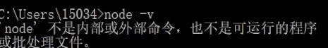

## 什么是 Node.js

官网的话（非常难理解，和人生真谛一样，在学习过程中慢慢理解，有一天就突然悟到了）：

- Node.js 是一个基于 Chrome V8 引擎的 JavaScript 运行环境。
- Node.js 使用了一个**事件驱动**、**非阻塞式 I/O** 的模型，使其轻量又高效。

思考：

在 Node.js 里运行 JavaScript 跟在 Chrome 里运行 JavaScript 有什么不同？

- Chrome 浏览器用的是同样的 JavaScript 引擎和模型。

- 在 Node.js 里写 JS 和在 Chrome 里写 JS ，几乎没有不一样！那不一样在哪里呢？

  - Node.js 没有浏览器 API ，即 document ，window 等。
  - 加了许多 Node.js API，即文件系统、进程等。

所以很好理解 Node.js 是什么？

- 对于开发者来说：你在 Chrome 里写 JavaScript 控制浏览器。Node.js 让你用类似的方式，控制整个计算机。

## Node.js 可以用来做什么

- Web 服务-腾讯视频
  - 搜索引擎优化 + 首屏速度优化 = 服务端渲染
  - 服务端渲染 + 前后端同构 = Node.js
- 构建工具流

  - 在有 gulp 和 webpack 之前，前端可能会用 java、shell 等做构建工具，前端程序员是很难对这些构建工具做修改或问题的查找

    - 构建工具不会永远不出问题
    - 构建工具不会永远满足需求

  - 使用 Node.js 做 JS 构建工具，是最保险的选择。

- 开发工具 - Visual Studio Code

  - 底层基于 Electron，它是在 node.js 的基础上封装了一层 Chrome 浏览器的内核，通过 node.js 和 Chrome 的结合，可以让开发者在 Chrome 里面再跑一个 node.js 或者说在 node.js 里面再跑一个 Chrome，同时具备了 nodejs 对整个计算机的控制能力以及网页渲染能力。

- 游戏 - wayward（沙盒类游戏自由度高）
  - 大型应用需要给使用者自定义模块的能力
  - 使用 Node.js 做复杂本地应用
    - 可以利用 JS 的灵活性提供外部扩展
    - JS 庞大的开发者基数让他们的灵活性得到利用
- 客户端应用 - twitch.tv

  - 在已有网站的情况下需要新开发客户端应用，用 Node.js 客户端技术（electron）实现，最大限度复用现有工程。

## 技术预研

什么是技术预研

- 分析要做的需求，找出技术难点。
- 针对每个技术难点设计 demo 进行攻克。

报错：终端找不到 node.js 的执行文件。

原因有 2 种：

- 1.没安装；
- 2.需要引入电脑环境变量的概念，它记载着所有可能在终端运行的程序的安装地址。比如在终端执行 node -v，就会去环境变量找 node 的安装地址，如果安装了还报错说明没找到，这时候需要手动配置一下。（可能是程序安装过程中没有自动注入，或者注入失败）

  

```js
//node index.js

console.log(__filename); //当前运行的脚本所在的位置
console.log(__dirname); //当前运行的脚本所在的目录位置
console.log(process); //记载了运行这个node.js程序进程的信息，如node.js版本、【cpuJsage（cpu占用率）、memoryUsage（内存占用率）】（这两个在后面性能分析时会会经常用到）、kill、exit（两个管理杀进程的操作）、hrtime（用来统计时间，时间精度可以到微秒级，在做一些时间统计时可以用这个函数）、env对象（打印node所运行的环境的环境变量，环境变量可以让你快速的在启动nodejs时做一些配置，让你的程序能在里面根据环境变量做一些分支，比如加一个debugger环境变量，然后你的nodejs运行可以以debugger模式运行）、argv（用户在启动node进程时敲击的命令是怎样的，这个属性可以用在做一些命令行程序的时候用到，后面的剪刀石头布游戏会用到）
```
