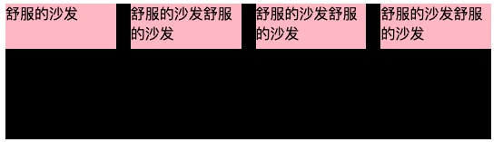
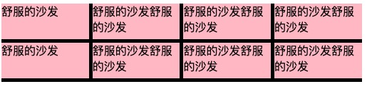

### 1.用 flex 布局解决的常见几种需求

场景 1:一个盒子中的 4 个子元素完全平分一行，即不会受子元素内容大小影响（flex:1 会受内容大小影响会变得大小不一），且需要有间隔。

<!--  -->

- 方式 1:通过给每个子元素精确计算的方式，适用于换行/不换行。

:::demo

```html
<!DOCTYPE html>
<html lang="en">
  <head>
    <meta charset="UTF-8" />
    <meta http-equiv="X-UA-Compatible" content="IE=edge" />
    <meta name="viewport" content="width=device-width, initial-scale=1.0" />
    <title>Document</title>
    <style>
      .parent {
        width: 60%;
        background-color: black;
        display: flex;
      }
      .child {
        margin: 0 5px 5px 0;
        min-width: calc((100% - 15px) / 4);
        max-width: calc((100% - 15px) / 4);
        width: calc((100% - 15px) / 4);
        height: 50px;
        background-color: pink;
      }
      .child:nth-child(4n) {
        margin-right: 0;
      }
    </style>
  </head>
  <body>
    <div class="parent">
      <div class="child">舒服的沙发</div>
      <div class="child">舒服的沙发舒服的沙发</div>
      <div class="child">舒服的沙发舒服的沙发</div>
      <div class="child">舒服的沙发舒服的沙发</div>
    </div>
  </body>
</html>
```

:::

- 方法 2:这种方式比较取巧，因为是给最外层盒子设的背景色，而给子元素的直接父元素设置 flex 布局，以及取减去子元素的 margin-right 值的宽度，为了精确获得子元素的 flex-basis，而 flex 又默认不换行，所以视觉效果上就达成了目标。但这种方式不适合换行，实际父元素撑满不了 4 个，所以 3 个就换行了。

```html
<!DOCTYPE html>
<html lang="en">
  <head>
    <meta charset="UTF-8" />
    <meta http-equiv="X-UA-Compatible" content="IE=edge" />
    <meta name="viewport" content="width=device-width, initial-scale=1.0" />
    <title>Document</title>
    <style>
      .box {
        width: 60%;
        background-color: black;
      }
      .parent {
        height: 150px;
        display: flex;
        width: calc(100% - 48px);
      }

      .child {
        background-color: pink;
        flex: 0 0 25%;
        height: 50px;
        margin-right: 16px;
      }
      .child:last-of-type {
        margin-right: 0;
      }
    </style>
  </head>
  <body>
    <div class="box">
      <div class="parent">
        <div class="child">舒服的沙发</div>
        <div class="child">舒服的沙发舒服的沙发</div>
        <div class="child">舒服的沙发舒服的沙发</div>
        <div class="child">舒服的沙发舒服的沙发</div>
      </div>
    </div>
  </body>
</html>
```

场景 2:一个盒子内部，子元素可以换行，但每一行平分 4 个，有间隔。

<!--  -->

:::demo

```html
<!DOCTYPE html>
<html lang="en">
  <head>
    <meta charset="UTF-8" />
    <meta http-equiv="X-UA-Compatible" content="IE=edge" />
    <meta name="viewport" content="width=device-width, initial-scale=1.0" />
    <title>Document</title>
    <style>
      .parent {
        width: 60%;
        background-color: black;
        display: flex;
        justify-content: flex-start;
        flex-wrap: wrap;
      }
      .child {
        margin: 0 5px 5px 0;
        min-width: calc((100% - 15px) / 4);
        max-width: calc((100% - 15px) / 4);
        width: calc((100% - 15px) / 4);
        height: 50px;
        background-color: pink;
      }
      .child:nth-child(4n) {
        margin-right: 0;
      }
    </style>
  </head>
  <body>
    <div class="box">
      <div class="parent">
        <div class="child">舒服的沙发</div>
        <div class="child">舒服的沙发舒服的沙发</div>
        <div class="child">舒服的沙发舒服的沙发</div>
        <div class="child">舒服的沙发舒服的沙发</div>
        <div class="child">舒服的沙发</div>
        <div class="child">舒服的沙发舒服的沙发</div>
        <div class="child">舒服的沙发舒服的沙发</div>
        <div class="child">舒服的沙发舒服的沙发</div>
      </div>
    </div>
  </body>
</html>
```

:::
