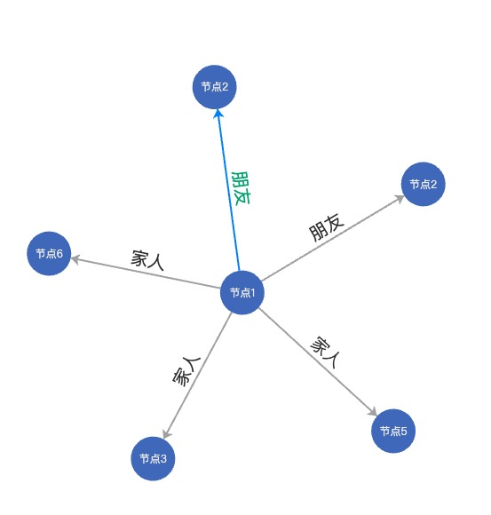
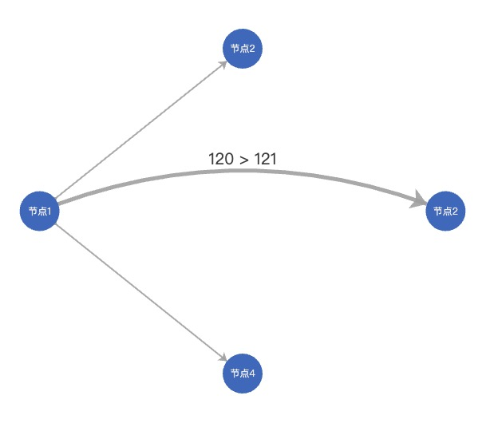

### 1.echarts 关系图节点重名问题解决方案

场景：在把人员姓名来做显示，遇到重名时，控制台会报错（data.name 不能重复）的解决方案

#### 解决方案 1

```js
/**
 * 思路：
 * TODO1:把data数据转换为[{name:0,showName:"节点1"},{name:1,showName:"节点2"},{name:2,showName:"节点2"},{name:3,showName:"节点3"},{name:4,showName:"节点5"},{name:5,showName:"节点6"}]
 * TODO2:links中的source和target改成源节点的索引
 * TODO3:label.normal.formatter函数返回showName字段，该属性可自定义节点内的文字
 */

//TODO1
var datas = [
  { name: "节点1" },
  { name: "节点2" },
  { name: "节点2" },
  { name: "节点3" },
  { name: "节点5" },
  { name: "节点6" },
];
var obj = {};
for (var i = 0; i < datas.length; i++) {
  obj[i] = datas[i].name;
}
var data = [];
for (var p in obj) {
  data.push({
    name: p,
    showName: obj[p],
    tooltip: {
      show: true,
      formatter: function (params) {
        return params.data.showName;
      },
    },
  });
}
var option = {
  tooltip: {
    show: false,
  },
  legend: {
    x: "center",
    data: ["家人", "朋友"],
  },
  animation: false,
  series: [
    {
      type: "graph",
      layout: "force",
      symbol: "circle",
      symbolSize: 50,
      roam: true, //禁止用鼠标滚轮缩小放大效果
      edgeSymbol: ["circle", "arrow"],
      edgeSymbolSize: [0, 10],
      // 连接线上的文字
      focusNodeAdjacency: true, //划过只显示对应关系
      edgeLabel: {
        normal: {
          show: true,
          textStyle: {
            fontSize: 20,
          },
          formatter: "{c}",
        },
      },
      lineStyle: {
        normal: {
          opacity: 1,
          width: 2,
          curveness: 0,
        },
      },
      //TODO2 圆圈内的文字
      label: {
        normal: {
          show: true,
          formatter: function (params) {
            return params.data.showName;
          },
        },
      },
      force: {
        repulsion: 5000,
      },
      data: data,
      //TODO3
      links: [
        {
          source: 0,
          target: 1,
          value: "朋友",
          lineStyle: {
            normal: {
              color: "#38f",
              curveness: 0, // 线的弯曲度 0-1之间 越大则歪曲度更大
            },
          },
          label: {
            normal: {
              textStyle: {
                color: "#07ac72",
              },
            },
          },
        },
        {
          source: 0,
          target: 2,
          value: "朋友",
        },
        {
          source: 0,
          target: 3,
          value: "家人",
        },
        {
          source: 0,
          target: 4,
          value: "家人",
        },
        {
          source: 0,
          target: 5,
          value: "家人",
        },
      ],
    },
  ],
};
```

效果图：


#### 解决方案 2

```js
/**
 * 思路：
 * TODO1:给 datas 里面加上一个唯一标识的，而这个字段名必须是id；
 * TODO2:links中的source和target用id值来替代
 * */
option = {
  title: {
    text: "Graph 简单示例",
  },
  tooltip: {},
  animationDurationUpdate: 1500,
  animationEasingUpdate: "quinticInOut",
  series: [
    {
      type: "graph",
      layout: "none",
      symbolSize: 50,
      roam: true,
      label: {
        normal: {
          show: true,
        },
      },
      edgeSymbol: ["circle", "arrow"],
      edgeSymbolSize: [4, 10],
      edgeLabel: {
        normal: {
          textStyle: {
            fontSize: 20,
          },
        },
      },
      data: [
        {
          name: "节点1",
          id: "120",
          x: 300,
          y: 300,
        },
        {
          name: "节点2",
          id: "121",
          x: 800,
          y: 300,
        },
        {
          name: "节点2",
          id: "123",
          x: 550,
          y: 100,
        },
        {
          name: "节点4",
          id: "124",
          x: 550,
          y: 500,
        },
      ],
      links: [
        {
          source: "120",
          target: "121",
          symbolSize: [5, 20],
          label: {
            normal: {
              show: true,
            },
          },
          lineStyle: {
            normal: {
              width: 5,
              curveness: 0.2,
            },
          },
        },
        {
          source: "120",
          target: "122",
          label: {
            normal: {
              show: true,
            },
          },
          lineStyle: {
            normal: { curveness: 0.2 },
          },
        },
        {
          source: "120",
          target: "123",
        },
        {
          source: "120",
          target: "124",
        },
      ],
      lineStyle: {
        normal: {
          opacity: 0.9,
          width: 2,
          curveness: 0,
        },
      },
    },
  ],
};
```

效果图：

