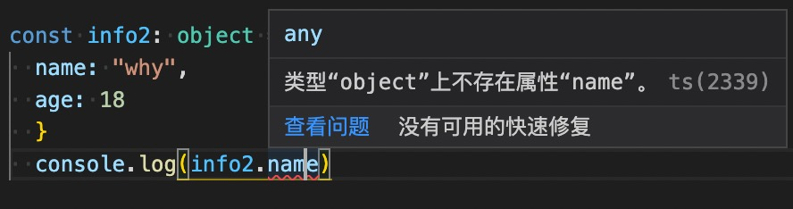

## JS 和 TS 相同的数据类型

### number 类型

- 数字类型是我们开发中经常使用的类型，TypeScript 和 JavaScript 一样，不区分整数类型（int）和浮点型（double），统一为 number 类型。
- ES6 新增了二进制和八进制的表示方法，而 TypeScript 也是支持二进制、八进制、十 六进制的表示：

```js
let num: number = 123;

let num1: number = 100; //十进制
let num2: number = 0b100; //二进制 0*2^0+0*2^1+1*2^2
let num3: number = 0o100; //八进制 0*8^0+0*8^1+1*8^2
let num4: number = 0x100; //十六进制 0*16^0+0*16^1+1*16^2

console.log(num1, num2, num3, num4); //100 4 64 256
```

### boolean 类型

- boolean 类型只有两个取值：true 和 false，非常简单

```js
let flag: boolean = true;
flag = 20 > 30; //false
```

### string 类型

- string 类型是字符串类型，可以使用单引号或者双引号表示；
- 同时也支持 ES6 的模板字符串来拼接变量和字符串：

```js
//可用单引号、双引号、ES6模板字符串语法
let message2: string = "Hello World";
```

- 个人习惯: 默认情况下, 如果可以推导出对应的标识符的类型时, 一般情况下是不加

```js
const name = "why";
const age = 18;
const height = 1.88;
let message3 = `name:${name} age:${age} height:${height}`;
```

### Array 类型

- 数组类型的定义也非常简单，有两种方式：

```js
const names1: Array<string> = []; // 不推荐(react jsx中是有冲突   <div></div>)
const names2: string[] = []; // 推荐
```

- 不好的习惯：以下的写法确定一个事实: names 是一个数组类型, 但是数组中存放的是什么类型的元素呢？默认表示 any。一个数组中在 TypeScript 开发中, 最好存放的数据类型是固定的，比如 string 就都是 string。

```js
const name = [];
names.push("abc");
names.push(123);
```

### Object 类型

- 方式 1：可以用 js 中的字面量定义方式，默认可以推导出来(推荐)

```js
//1.默认有推导出来，name是string类型，age是number类型
const info = {
  name: "why",
  age: 18,
};
console.log(info.name);
```

- 方式 2：object 对象类型可以用于描述一个对象。但是这样定义后的变量，我们不能获取对象属性的值，也不能设置数据：

```js
/**
 * 原因：因为 ts 编译器会先对 ts 代码编译成 js，再对它进行执行。但现在编译也通不过。
 * 在编译时，它会认为 info2 已经指定了 object 类型。但是对于普通的 object 类型，它是没有我们的属性的。如下图：
 */
const info2: object = {
  name: "why",
  age: 18,
};
console.log(info2.name);
```

如图：比如用鼠标移到下方 info2.name 上，会提示类型“object”上不存在属性“name”。


### null 和 undefined 类型

- 在 JavaScript 中，undefined 和 null 是两个基本数据类型。
- 在 TypeScript 中，它们各自的类型也是 undefined 和 null，也就意味着它们既是实际的值，也是自己的类型。（如指定 null 类型的值只能是 null）

```js
//在TypeScript中，它们各自的类型也是undefined和null，也就意味着它们既是实际的值，也是自己的类型：
let n1: null = null;
let n2: undefined = undefined;

//注意：这里不写类型注解的话，默认推导出来的是any类型。这种情况就不要让它推断了
let n3 = null;
let n4 = undefined;
```

### Symbol 类型

```js
/**symbol的一个应用场景 */
//在ES5中，如果我们是不可以在对象中添加相同的属性名称的，比如下面的做法：
const person = {
  identity: "程序员",
  identity: "老师",
};
//通常我们的做法是定义两个不同的属性名字：比如identity1和identity2。
const person1 = {
  identity1: "程序员",
  identity2: "老师",
};

//但是我们也可以通过symbol来定义相同的名称，因为Symbol函数返回的是不同的值：
const title1 = Symbol("title");
const title2 = Symbol("title");

const info = {
  [title1]: "程序员",
  [title2]: "老师",
};

//取值
info[title1];
info[title2];
```
